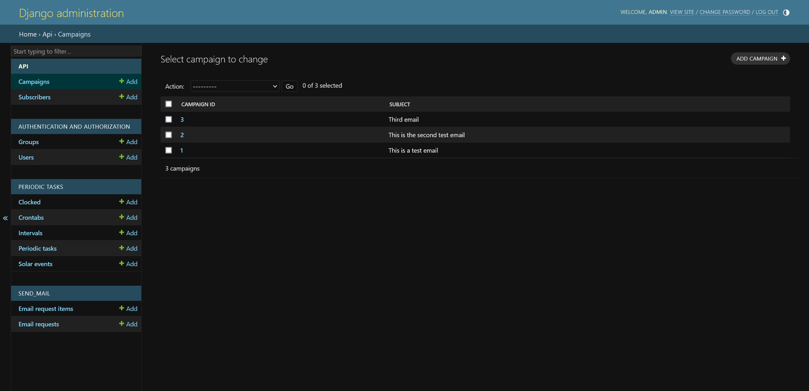
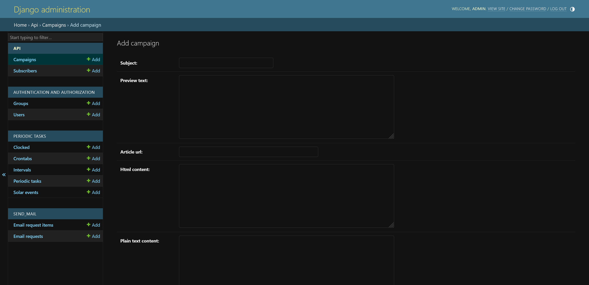
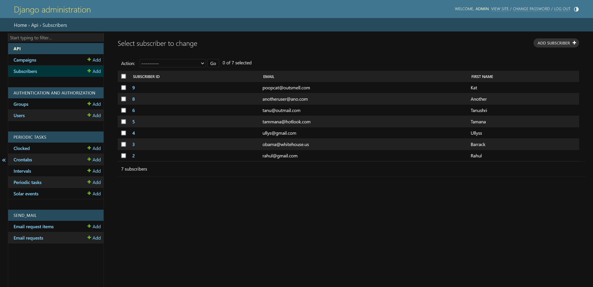

# Django Email Campaign Manager


This is a Django application for managing email campaigns. It allows you to create, schedule, and send email campaigns to a list of subscribers.

## Features

- Create and manage campaigns
- Schedule campaigns for future delivery
- Send campaigns to a list of subscribers concurrently
- Track campaign delivery status for each user
- Resend campaign to users that did not receive it

## Installation

1. Clone the repository to your local machine:

```bash
git clone https://github.com/username/django-email-campaign-manager.git
```

2. Install the required packages:

```bash
pip install -r requirements.txt
```

3. Apply migrations:

```bash
python manage.py migrate
```

4. Start the development server:

```bash
python manage.py runserver
```
6. Start the celery and celery beat for scheuling tasks
```bash
celery -A email_campaign_manager worker -l info
celery -A email_campaign_manager beat -l info --scheduler django_celery_beat.schedulers:DatabaseScheduler
```
7. Make sure you have PostgreSQL and Redis up and running. You can also use an SMTP to send real emails. Configure the following environment variables.

```
DJANGO_SECRET_KEY = 
DEBUG = 
DB_NAME = 
DB_USER = 
DB_PASSWORD = 

EMAIL_USER = 
EMAIL_PASSWORD = 
EMAIL_EMAIL =
```
Access the application at [http://localhost:8000/admin](http://localhost:8000/admin)

## Usage

1. Log in to the Django admin interface.
2. Create campaigns with subject, preview text, article URL, and content.
3. Add subscribers to the list.
4. Schedule or send campaigns to the list of subscribers using API endpoints.
5. Track the status of sent campaigns using Email Requests.

## API Endpoints
```api/v1/subscribers/<subscriber_id>```
Unsubscriber a user

```api/v1/campaign/<campaign_id>/send-email```
Send a campaign to all subscribers
  
```api/v1/email-request/<email_request_id>/resend-email```
Resend a created email request incase some users failed to receive the campaign

## Screenshots







## License

This project is licensed under the MIT License - see the [LICENSE](LICENSE) file for details.
